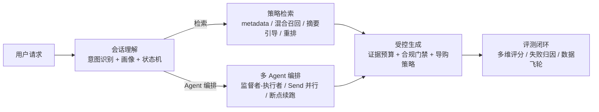

# 多智能体编排底座 · Multi-Agent Orchestration Base

> 基于 LangGraph 的多智能体编排与 RAG 检索增强底座：监督者-执行者编排、策略驱动检索、
> 意图识别、会话记忆、成本控制与评测闭环。


---

## 为什么值得关注

- **LangGraph 深度工程化**：`Send` 动态并行、`RemainingSteps` 步数护栏、重试策略、PostgresSaver 断点续跑、多 Schema 状态收缩，生产级容错而不是玩具 demo。
- **RAG 不是调包，是策略引擎**：意图三层识别（规则 → LLM → 向量兜底）、查询改写、按意图组合检索通道（metadata 精确过滤 / 混合召回 / 摘要引导），每一步决策可 Trace。
- **成本控制做到配置级**：动态温度、证据预算、上下文四级降级（全量 → 滑动窗口 → 规则压缩 → LLM 摘要）、pro / flash 模型分档。
- **评测即发布门禁**：自研多维评测 + LLM-as-judge + 失败归因 + 数据飞轮，改一次检索或提示词，效果有数据说话。
- **会话级意图与销售状态机**：购买阶段（挖需 → 推荐 → 异议 → 促单 → 连带 → 售后）由确定性状态机驱动，画像消解缺失需求，媒体按需展示。

## 架构



## 核心模块

| 模块 | 说明 |
| --- | --- |
| `agents/` | 多 Agent 编排（TaskPlan / 监督者 / 子 Agent 并行）、导购状态机、情绪路由、记忆提炼 |
| `retrieval/` | 意图三层识别、查询改写、检索策略决策、混合召回（稠密 + BM25）、RRF 融合、重排、语义兜底 |
| `chains/` | 受控生成、SSE 流式、安全合规评估 |
| `graphs/` | LangGraph StateGraph 确定性主链路（route → sales → retrieve → safety → generate） |
| `monitoring/` | Token 用量、失败统计、告警 |
| `storage/` | PG 真相源、Redis 缓存、向量库适配、会话记忆 |

## 快速开始（后端）

依赖服务：Qdrant、PostgreSQL、Redis、Ollama（bge-m3）、TEI（reranker），本地或 Docker 均可。

```bash
cp .env.example .env
pip install -e .
uvicorn agent_base.api.main:app --app-dir src --host 0.0.0.0 --port 8000
```

接口与文档：`http://localhost:8000/docs`；健康检查 `GET /api/health`。

## 测试与评测

```bash
# 契约测试（意图 / 状态机 / 媒体门控 / 回答格式）
pytest tests/contracts -q

# 意图识别 + 导购状态机离线评测（130+ 条用例，CI 门禁）
python scripts/eval_intent_stage.py

# 全维度长对话评测（8 场景，真实模型）
python scripts/longchat/build_scenarios.py
python scripts/longchat/eval_long_conversation.py --scenario s2
```

评测报告示例见 `reports/longchat/eval_report.md`。

## 开源范围说明

- **本仓库开源的是 AI 底座**：多智能体编排、RAG 检索增强、意图识别、评测闭环、记忆与成本控制，以及配套契约测试与评测工具。
- **以下内容为私有实现，不随仓库开源**：业务知识库真实数据、专家级销售话术、前端三端源码、部署配置与内部运维脚本。仓库内仅保留脱敏示例数据（`data/ecommerce/md`）用于演示知识库格式与跑通 demo。

## License

MIT
